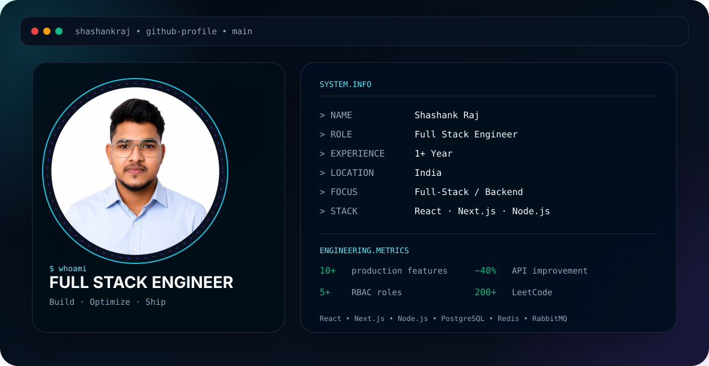

<p align="center">
  <a href="https://github.com/Shashankraj72777">
    
  </a>
</p>

<p align="center">
  <a href="https://portfolio-iota-eight-coskywto4u.vercel.app/">Portfolio</a>
  &nbsp;•&nbsp;
  <a href="https://github.com/Shashankraj72777">GitHub</a>
  &nbsp;•&nbsp;
  <a href="https://www.linkedin.com/in/shashankraj72777/">LinkedIn</a>
  &nbsp;•&nbsp;
  <a href="https://leetcode.com/u/shashankraj72777/">LeetCode</a>
</p>

---

# `SYSTEM.INFO`

```text
> NAME        Shashank Raj
> ROLE        Full Stack Engineer
> EXPERIENCE  1+ Year
> LOCATION    India
> FOCUS       Full-Stack / Backend Engineering
> STACK       React · Next.js · Node.js · TypeScript
> DATABASE    PostgreSQL · Redis · Supabase
> SYSTEMS     Microservices · RabbitMQ · REST APIs
```

---

## `~/profile`

I'm a **Full Stack Engineer** with **1+ year of production experience** building modern web applications with React/Next.js and Node.js/PostgreSQL.

My work focuses on building production features, improving API performance, designing backend services, implementing authentication and authorization, and developing real-time and distributed systems.

```text
10+     production features shipped
~40%    API response-time improvement
~30%    reduction in reported bugs
5+      RBAC roles implemented
3       live full-stack projects
200+    LeetCode problems solved
```

---

# `ENGINEERING.FOCUS`

```text
┌──────────────────────────────────────────────────────────┐
│                                                          │
│  FULL-STACK DEVELOPMENT                                  │
│  React.js · Next.js · Node.js                            │
│                                                          │
│  BACKEND ENGINEERING                                     │
│  Express.js · REST APIs · PostgreSQL · Redis              │
│                                                          │
│  DISTRIBUTED SYSTEMS                                     │
│  Microservices · RabbitMQ · Event-Driven Architecture    │
│                                                          │
│  SECURITY                                                │
│  JWT · RBAC                                              │
│                                                          │
│  REAL-TIME SYSTEMS                                       │
│  Socket.IO · Redis                                      │
│                                                          │
│  DEVOPS                                                  │
│  Docker · GitHub Actions · CI/CD                         │
│                                                          │
│  AI                                                       │
│  LLM APIs · Prompt Engineering                           │
│                                                          │
└──────────────────────────────────────────────────────────┘
```

---

# `TECH.STACK`

### Languages

<p>
  
</p>

`TypeScript` · `JavaScript` · `SQL` · `C++`

### Frontend

<p>
  
</p>

`React.js` · `Next.js` · `Tailwind CSS`

### Backend

<p>
  
</p>

`Node.js` · `Express.js` · `REST APIs` · `Socket.IO` · `Microservices`

### Messaging & Systems

`RabbitMQ` · `Redis`

### Databases

<p>
  
</p>

`PostgreSQL` · `Supabase`

### Authentication

`JWT` · `RBAC`

### DevOps

<p>
  
</p>

`Docker` · `Git` · `GitHub Actions` · `CI/CD`

### AI / Cloud

`LLM APIs` · `Prompt Engineering` · `Vercel` · `Render`

---

# `FEATURED.PROJECTS`

## `01` — TrackMint

### AI-Assisted Expense Dashboard

```text
Next.js 15
TypeScript
Supabase
PostgreSQL
OpenAI / Gemini
Tailwind CSS
```

A responsive expense dashboard with secure authentication, PostgreSQL Row-Level Security, CRUD operations, analytics, and modern Next.js architecture.

### Highlights

- Dark/light themed responsive interface
- Skeleton loading states
- Supabase authentication
- PostgreSQL Row-Level Security
- Secure CRUD operations
- Monthly delta calculations
- Category aggregation
- Composite-indexed queries
- Next.js Server Components and Server Actions
- Targeted cache invalidation

---

## `02` — AI Mock Interview Platform

```text
Next.js
TypeScript
Node.js
Socket.IO
PostgreSQL
Redis
LLM APIs
Vercel
Render
Upstash
```

A real-time AI interview platform designed around interactive engineering interviews.

### Highlights

- Supports **30 engineering roles**
- Real-time interview state using Socket.IO
- In-browser Monaco code editor
- Redis-backed live sessions
- PostgreSQL checkpoints
- Multiple LLM providers
- Next.js and TypeScript frontend
- Real-time backend architecture

### Architecture

```text
                    ┌─────────────────────┐
                    │      Next.js UI     │
                    │   Interview Client  │
                    └──────────┬──────────┘
                               │
                               ▼
                    ┌─────────────────────┐
                    │      Socket.IO       │
                    │    Real-Time Layer   │
                    └──────────┬──────────┘
                               │
                    ┌──────────┴──────────┐
                    ▼                     ▼
             ┌─────────────┐      ┌─────────────┐
             │    Redis    │      │ PostgreSQL  │
             │ Live State  │      │ Checkpoints │
             └─────────────┘      └─────────────┘
                               │
                               ▼
                    ┌─────────────────────┐
                    │      LLM APIs       │
                    │ AI Interview Engine │
                    └─────────────────────┘
```

---

## `03` — Scalr

### Distributed Order System

```text
Node.js
TypeScript
PostgreSQL
Redis
RabbitMQ
Docker
```

A distributed order system built using microservices and event-driven communication.

### Highlights

- Microservice architecture
- RabbitMQ event-driven communication
- Redis caching
- PostgreSQL persistence
- Retry handling
- Dead-letter queues
- Docker Compose development environment

### Architecture

```text
                       ┌─────────────────┐
                       │   API Gateway   │
                       └────────┬────────┘
                                │
                                ▼
                       ┌─────────────────┐
                       │  Auth Service   │
                       └────────┬────────┘
                                │
                                ▼
                       ┌─────────────────┐
                       │  User Service   │
                       └────────┬────────┘
                                │
                                ▼
                       ┌─────────────────┐
                       │ Order Service   │
                       └────────┬────────┘
                                │
                                ▼
                    ┌────────────────────────┐
                    │ Notification Service  │
                    └───────────┬────────────┘
                                │
                    ┌───────────┴───────────┐
                    ▼                       ▼
             ┌─────────────┐         ┌─────────────┐
             │ PostgreSQL  │         │    Redis    │
             │   Storage   │         │    Cache    │
             └─────────────┘         └─────────────┘

                    RabbitMQ
                 Event Messaging
```

---

# `PROFESSIONAL.EXPERIENCE`

## Junior Full Stack Developer

### R2VFX Studios Pvt. Ltd.

`Jul 2025 – Sep 2026`

```text
React.js · Next.js
Node.js · Express.js
PostgreSQL · Redis
JWT · RBAC
Docker · GitHub Actions · CI/CD
```

### Engineering Work

- Built reusable React/Next.js UI components and internal dashboards.
- Shipped **10+ production features** across React/Next.js and Node.js/Express.
- Reduced reported bugs by approximately **30%**.
- Reduced API response times by approximately **40%** on high-traffic endpoints.
- Added PostgreSQL indexes and eliminated N+1 query patterns.
- Implemented JWT authentication.
- Implemented RBAC across **5+ user roles**.
- Maintained GitHub Actions CI/CD pipelines.
- Credited as part of the R2VFX Studios technology team on **Dhurandhar 2 (2026)**.

---

## Cloud Research Analyst Intern — Software Development

### CLARCHS.com

`Jan 2025 – Apr 2025`

```text
React.js · Next.js
JavaScript
REST APIs
```

### Engineering Work

- Built **8+ reusable React/Next.js components**.
- Integrated **4 REST APIs**.
- Reduced duplicate frontend code by approximately **25%**.
- Improved page responsiveness by approximately **20%**.

---

# `ENGINEERING.IMPACT`

```text
┌───────────────────────────────────────────────────────────┐
│                                                           │
│   10+       Production features shipped                  │
│                                                           │
│   ~40%      API response-time improvement                │
│                                                           │
│   ~30%      Reduction in reported bugs                    │
│                                                           │
│   5+        RBAC roles                                    │
│                                                           │
│   8+        Reusable React / Next.js components           │
│                                                           │
│   4         REST API integrations                         │
│                                                           │
│   3         Live full-stack projects                      │
│                                                           │
│   200+      LeetCode problems                             │
│                                                           │
└───────────────────────────────────────────────────────────┘
```

---

# `DSA.LOG`

```cpp
while (learning) {
    solve();
    analyze();
    optimize();
    repeat();
}
```

### LeetCode

**200+ problems solved using C++**

<a href="https://leetcode.com/u/shashankraj72777/">
  
</a>

---

# `EDUCATION`

### Chandigarh University, Mohali

**B.Tech — Computer Science Engineering (AI & ML)**

`2021 – 2025`

**CGPA: 7.91 / 10**

---

# `CURRENT.FOCUS`

```text
> Building full-stack applications
> Improving backend performance
> Designing scalable APIs
> Exploring distributed systems
> Building real-time applications
> Working with LLM-powered applications
> Practicing Data Structures & Algorithms
```

---

# `GITHUB.ACTIVITY`

<p align="center">


</p>

---

# `CONNECT`

<p align="center">

<a href="https://github.com/Shashankraj72777">
  
</a>

<a href="https://www.linkedin.com/in/shashankraj72777/">
  
</a>

<a href="https://portfolio-iota-eight-coskywto4u.vercel.app/">
  
</a>

<a href="https://leetcode.com/u/shashankraj72777/">
  
</a>

<a href="mailto:shashankraj72777@gmail.com">
  
</a>

</p>

---

<div align="center">

```text
┌───────────────────────────────────────────────┐
│                                               │
│              BUILD · OPTIMIZE · SHIP         │
│                                               │
└───────────────────────────────────────────────┘
```

**Full Stack Engineer · Backend Focused · Production Systems**

</div>
